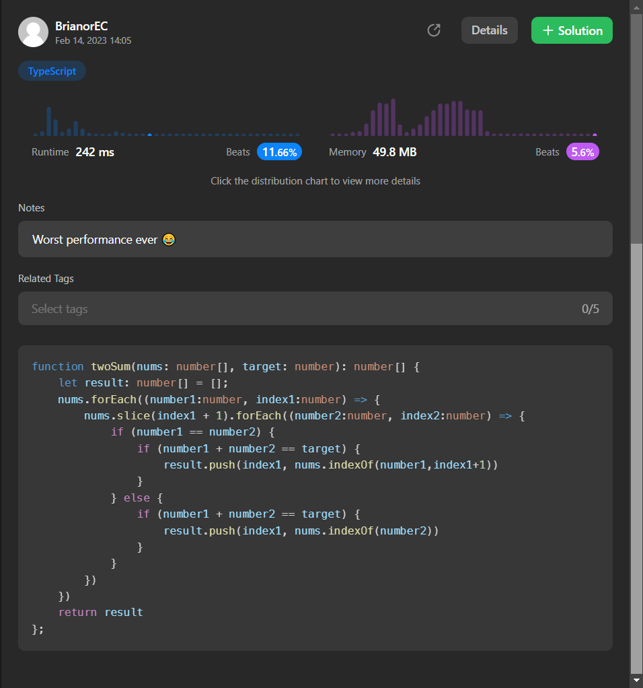

# Two_Sum

Given an array of integers nums and an integer target, return indices of the two numbers such that they add up to target.

You may assume that each input would have exactly one solution, and you may not use the same element twice.

You can return the answer in any order.

 - Example 1:

Input: nums = [2,7,11,15], target = 9
Output: [0,1]
Explanation: Because nums[0] + nums[1] == 9, we return [0, 1].

 - Example 2:

Input: nums = [3,2,4], target = 6
Output: [1,2]

 - Example 3:

Input: nums = [3,3], target = 6
Output: [0,1]
## Installation

Install my-project with npm

```bash
  cd my-project
  npm install typescript --save-dev
  tsc --init
```
    
## Usage/Examples

```javascript
tsc --watch
```


## Authors

- [@DavidGarciaManzana](https://github.com/DavidGarciaManzana)


## Acknowledgements

 - [Two Sum - Leetcode](https://leetcode.com/problems/two-sum/)
 
## To Improve

It looks like there's room for improvement in my code, but I'm eager to work on it and make it even better!
 
 
 <p align="center">
  
</p>


